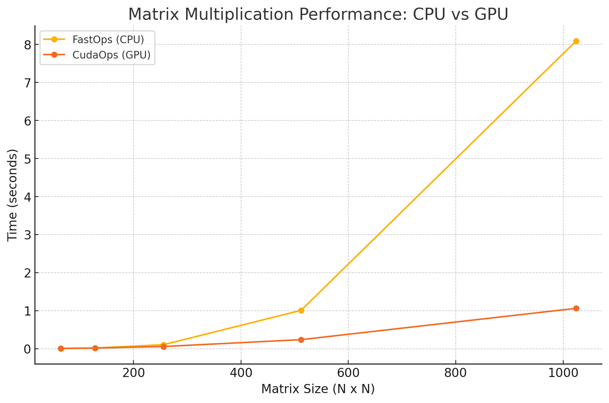

# MiniTorch Module 3


* Docs: https://minitorch.github.io/

* Overview: https://minitorch.github.io/module3.html


You will need to modify `tensor_functions.py` slightly in this assignment.

* Tests:

```
python run_tests.py
```

* Note:

Several of the tests for this assignment will only run if you are on a GPU machine and will not
run on github's test infrastructure. Please follow the instructions to setup up a colab machine
to run these tests.

This assignment requires the following files from the previous assignments. You can get these by running

```bash
python sync_previous_module.py previous-module-dir current-module-dir
```

The files that will be synced are:

        minitorch/tensor_data.py minitorch/tensor_functions.py minitorch/tensor_ops.py minitorch/operators.py minitorch/scalar.py minitorch/scalar_functions.py minitorch/module.py minitorch/autodiff.py minitorch/module.py project/run_manual.py project/run_scalar.py project/run_tensor.py minitorch/operators.py minitorch/module.py minitorch/autodiff.py minitorch/tensor.py minitorch/datasets.py minitorch/testing.py minitorch/optim.py

<br>
<br>

<details>

<summary>Diagnostics output from script:</summary>
MAP

================================================================================
 Parallel Accelerator Optimizing:  Function tensor_map.<locals>._map,
/Users/winstontsui/Desktop/CS 5781 Machine Learning
Engineering/mod3-winstontsuicornell/minitorch/fast_ops.py (172)
================================================================================


Parallel loop listing for  Function tensor_map.<locals>._map, /Users/winstontsui/Desktop/CS 5781 Machine Learning Engineering/mod3-winstontsuicornell/minitorch/fast_ops.py (172)
----------------------------------------------------------------------------------|loop #ID
    def _map(                                                                     |
        out: Storage,                                                             |
        out_shape: Shape,                                                         |
        out_strides: Strides,                                                     |
        in_storage: Storage,                                                      |
        in_shape: Shape,                                                          |
        in_strides: Strides,                                                      |
    ) -> None:                                                                    |
        # Task 3.1.                                                               |
        if (                                                                      |
            (len(in_shape) == len(out_shape))                                     |
            and (in_shape == out_shape).all()-------------------------------------| #0
            and (in_strides == out_strides).all()---------------------------------| #1
        ):                                                                        |
            for i in prange(len(out)):--------------------------------------------| #2
                out[i] = fn(in_storage[i])                                        |
        else:                                                                     |
            for i in prange(len(out)):--------------------------------------------| #3
                in_idx = in_shape.copy()                                          |
                out_idx = out_shape.copy()                                        |
                to_index(i, out_shape, out_idx)                                   |
                broadcast_index(out_idx, out_shape, in_shape, in_idx)             |
                out[i] = fn(in_storage[index_to_position(in_idx, in_strides)])    |
--------------------------------- Fusing loops ---------------------------------
Attempting fusion of parallel loops (combines loops with similar properties)...
Following the attempted fusion of parallel for-loops there are 4 parallel for-
loop(s) (originating from loops labelled: #0, #1, #2, #3).
--------------------------------------------------------------------------------
----------------------------- Before Optimisation ------------------------------
--------------------------------------------------------------------------------
------------------------------ After Optimisation ------------------------------
Parallel structure is already optimal.
--------------------------------------------------------------------------------
--------------------------------------------------------------------------------

---------------------------Loop invariant code motion---------------------------
Allocation hoisting:
No allocation hoisting found
None
ZIP

================================================================================
 Parallel Accelerator Optimizing:  Function tensor_zip.<locals>._zip,
/Users/winstontsui/Desktop/CS 5781 Machine Learning
Engineering/mod3-winstontsuicornell/minitorch/fast_ops.py (225)
================================================================================


Parallel loop listing for  Function tensor_zip.<locals>._zip, /Users/winstontsui/Desktop/CS 5781 Machine Learning Engineering/mod3-winstontsuicornell/minitorch/fast_ops.py (225)
-----------------------------------------------------------------------------------------------------------------------------------------------|loop #ID
    def _zip(                                                                                                                                  |
        out: Storage,                                                                                                                          |
        out_shape: Shape,                                                                                                                      |
        out_strides: Strides,                                                                                                                  |
        a_storage: Storage,                                                                                                                    |
        a_shape: Shape,                                                                                                                        |
        a_strides: Strides,                                                                                                                    |
        b_storage: Storage,                                                                                                                    |
        b_shape: Shape,                                                                                                                        |
        b_strides: Strides,                                                                                                                    |
    ) -> None:                                                                                                                                 |
        # TODO: Implement for Task 3.1.                                                                                                        |
        # out_index = np.zeros(len(out_shape), dtype=np.int32)  # Buffer for output index                                                      |
        # for i in prange(len(out)):  # Parallel loop                                                                                          |
        #     to_index(i, out_shape, out_index)  # Convert flat index to multidimensional index                                                |
        #     a_pos = index_to_position(out_index, a_strides)  # Get position in a_storage                                                     |
        #     b_pos = index_to_position(out_index, b_strides)  # Get position in b_storage                                                     |
        #     out[i] = fn(a_storage[a_pos], b_storage[b_pos])  # Apply function and store result                                               |
        out_size = len(out)                                                                                                                    |
        out_len = len(out_shape)                                                                                                               |
        a_len = len(a_shape)                                                                                                                   |
        b_len = len(b_shape)                                                                                                                   |
        if ((a_len == b_len) and (a_strides == b_strides).all() and (a_shape == b_shape).all() and (b_strides == out_strides).all()):----------| #4, 5, 6
            for i in prange(out_size):---------------------------------------------------------------------------------------------------------| #7
                out[i] = fn(a_storage[i], b_storage[i])                                                                                        |
        else:                                                                                                                                  |
            for i in prange(out_size):---------------------------------------------------------------------------------------------------------| #8
                out_index = np.empty(out_len, np.int32)                                                                                        |
                a_index = np.empty(a_len, np.int32)                                                                                            |
                b_index = np.empty(b_len, np.int32)                                                                                            |
                # Gaining the out_index                                                                                                        |
                to_index(i, out_shape, out_index)                                                                                              |
                # Gain the a_index from the out_index                                                                                          |
                broadcast_index(out_index, out_shape, a_shape, a_index)                                                                        |
                # Gain the b_index from the out_index                                                                                          |
                broadcast_index(out_index, out_shape, b_shape, b_index)                                                                        |
                # Finding the a_storage position from the a_index                                                                              |
                a_pos = index_to_position(a_index, a_strides)                                                                                  |
                # Finding the b_storage position from the b_index                                                                              |
                b_pos = index_to_position(b_index, b_strides)                                                                                  |
                # Finding the out_storage position from the out_index                                                                          |
                #out_pos = index_to_position(out_index, out_strides)                                                                           |
                # Throwing it in storage                                                                                                       |
                out[i] = fn(a_storage[a_pos], b_storage[b_pos])                                                                                |
--------------------------------- Fusing loops ---------------------------------
Attempting fusion of parallel loops (combines loops with similar properties)...
Following the attempted fusion of parallel for-loops there are 5 parallel for-
loop(s) (originating from loops labelled: #4, #5, #6, #7, #8).
--------------------------------------------------------------------------------
----------------------------- Before Optimisation ------------------------------
--------------------------------------------------------------------------------
------------------------------ After Optimisation ------------------------------
Parallel structure is already optimal.
--------------------------------------------------------------------------------
--------------------------------------------------------------------------------

---------------------------Loop invariant code motion---------------------------
Allocation hoisting:
The memory allocation derived from the instruction at
/Users/winstontsui/Desktop/CS 5781 Machine Learning
Engineering/mod3-winstontsuicornell/minitorch/fast_ops.py (252) is hoisted out
of the parallel loop labelled #8 (it will be performed before the loop is
executed and reused inside the loop):
   Allocation:: out_index = np.empty(out_len, np.int32)
    - numpy.empty() is used for the allocation.
The memory allocation derived from the instruction at
/Users/winstontsui/Desktop/CS 5781 Machine Learning
Engineering/mod3-winstontsuicornell/minitorch/fast_ops.py (253) is hoisted out
of the parallel loop labelled #8 (it will be performed before the loop is
executed and reused inside the loop):
   Allocation:: a_index = np.empty(a_len, np.int32)
    - numpy.empty() is used for the allocation.
The memory allocation derived from the instruction at
/Users/winstontsui/Desktop/CS 5781 Machine Learning
Engineering/mod3-winstontsuicornell/minitorch/fast_ops.py (254) is hoisted out
of the parallel loop labelled #8 (it will be performed before the loop is
executed and reused inside the loop):
   Allocation:: b_index = np.empty(b_len, np.int32)
    - numpy.empty() is used for the allocation.
None
REDUCE

================================================================================
 Parallel Accelerator Optimizing:  Function tensor_reduce.<locals>._reduce,
/Users/winstontsui/Desktop/CS 5781 Machine Learning
Engineering/mod3-winstontsuicornell/minitorch/fast_ops.py (297)
================================================================================


Parallel loop listing for  Function tensor_reduce.<locals>._reduce, /Users/winstontsui/Desktop/CS 5781 Machine Learning Engineering/mod3-winstontsuicornell/minitorch/fast_ops.py (297)
------------------------------------------------------------------------------------------------------|loop #ID
    def _reduce(                                                                                      |
        out: Storage,                                                                                 |
        out_shape: Shape,                                                                             |
        out_strides: Strides,                                                                         |
        a_storage: Storage,                                                                           |
        a_shape: Shape,                                                                               |
        a_strides: Strides,                                                                           |
        reduce_dim: int,                                                                              |
    ) -> None:                                                                                        |
        # TODO: Implement for Task 3.1.                                                               |
        # out_index = np.zeros(len(out_shape), dtype=np.int32)  # Buffer for output index             |
        # in_index = np.zeros(len(a_shape), dtype=np.int32)  # Buffer for input index                 |
        # for i in prange(len(out)):  # Parallel loop                                                 |
        #     to_index(i, out_shape, out_index)  # Convert flat index to multidimensional index       |
        #     reduced_value = out[i]  # Start with the initial value in the output tensor             |
        #     for j in range(a_shape[reduce_dim]):  # Iterate along the reduction dimension           |
        #         in_index[:] = out_index  # Copy current index                                       |
        #         in_index[reduce_dim] = j  # Update index for the reduction dimension                |
        #         in_pos = index_to_position(in_index, a_strides)  # Get position in input storage    |
        #         reduced_value = fn(reduced_value, a_storage[in_pos])  # Apply reduction             |
        #     out[i] = reduced_value  # Write reduced result to output tensor                         |
                                                                                                      |
        reduce_size = a_shape[reduce_dim]                                                             |
        for i in prange(len(out)):--------------------------------------------------------------------| #10
            out_index: Index = np.zeros(MAX_DIMS, np.int32)-------------------------------------------| #9
            to_index(i, out_shape, out_index)                                                         |
            o = index_to_position(out_index, out_strides)                                             |
            for s in range(reduce_size):                                                              |
                out_index[reduce_dim] = s                                                             |
                j = index_to_position(out_index, a_strides)                                           |
                out[o] = fn(out[o], a_storage[j])                                                     |
--------------------------------- Fusing loops ---------------------------------
Attempting fusion of parallel loops (combines loops with similar properties)...
Following the attempted fusion of parallel for-loops there are 2 parallel for-
loop(s) (originating from loops labelled: #10, #9).
--------------------------------------------------------------------------------
---------------------------- Optimising loop nests -----------------------------
Attempting loop nest rewrites (optimising for the largest parallel loops)...

+--10 is a parallel loop
   +--9 --> rewritten as a serial loop
--------------------------------------------------------------------------------
----------------------------- Before Optimisation ------------------------------
Parallel region 0:
+--10 (parallel)
   +--9 (parallel)


--------------------------------------------------------------------------------
------------------------------ After Optimisation ------------------------------
Parallel region 0:
+--10 (parallel)
   +--9 (serial)


Parallel region 0 (loop #10) had 0 loop(s) fused and 1 loop(s) serialized as
part of the larger parallel loop (#10).
--------------------------------------------------------------------------------
--------------------------------------------------------------------------------

---------------------------Loop invariant code motion---------------------------
Allocation hoisting:
The memory allocation derived from the instruction at
/Users/winstontsui/Desktop/CS 5781 Machine Learning
Engineering/mod3-winstontsuicornell/minitorch/fast_ops.py (321) is hoisted out
of the parallel loop labelled #10 (it will be performed before the loop is
executed and reused inside the loop):
   Allocation:: out_index: Index = np.zeros(MAX_DIMS, np.int32)
    - numpy.empty() is used for the allocation.
None
MATRIX MULTIPLY

================================================================================
 Parallel Accelerator Optimizing:  Function _tensor_matrix_multiply,
/Users/winstontsui/Desktop/CS 5781 Machine Learning
Engineering/mod3-winstontsuicornell/minitorch/fast_ops.py (334)
================================================================================


Parallel loop listing for  Function _tensor_matrix_multiply, /Users/winstontsui/Desktop/CS 5781 Machine Learning Engineering/mod3-winstontsuicornell/minitorch/fast_ops.py (334)
----------------------------------------------------------------------------------------------|loop #ID
def _tensor_matrix_multiply(                                                                  |
    out: Storage,                                                                             |
    out_shape: Shape,                                                                         |
    out_strides: Strides,                                                                     |
    a_storage: Storage,                                                                       |
    a_shape: Shape,                                                                           |
    a_strides: Strides,                                                                       |
    b_storage: Storage,                                                                       |
    b_shape: Shape,                                                                           |
    b_strides: Strides,                                                                       |
) -> None:                                                                                    |
    """NUMBA tensor matrix multiply function.                                                 |
                                                                                              |
    Args:                                                                                     |
        out (Storage): storage for `out` tensor                                               |
        out_shape (Shape): shape for `out` tensor                                             |
        out_strides (Strides): strides for `out` tensor                                       |
        a_storage (Storage): storage for `a` tensor                                           |
        a_shape (Shape): shape for `a` tensor                                                 |
        a_strides (Strides): strides for `a` tensor                                           |
        b_storage (Storage): storage for `b` tensor                                           |
        b_shape (Shape): shape for `b` tensor                                                 |
        b_strides (Strides): strides for `b` tensor                                           |
                                                                                              |
    Returns:                                                                                  |
        None: Fills in `out`.                                                                 |
                                                                                              |
    """                                                                                       |
    # batch_size, out_rows, out_cols = out_shape                                              |
    # a_rows, a_cols = a_shape[-2], a_shape[-1]                                               |
    # b_rows, b_cols = b_shape[-2], b_shape[-1]                                               |
                                                                                              |
    # # Ensure matrix dimensions match for multiplication                                     |
    # assert a_cols == b_rows                                                                 |
                                                                                              |
    # for n in prange(batch_size):  # Parallelize over batches                                |
    #     for i in range(out_rows):  # Iterate over rows of the output                        |
    #         for j in range(out_cols):  # Iterate over columns of the output                 |
    #             out_index = n * out_strides[0] + i * out_strides[1] + j * out_strides[2]    |
    #             sum_value = 0.0  # Local variable to accumulate the dot product             |
                                                                                              |
    #             for k in range(a_cols):  # Iterate over the inner dimension                 |
    #                 a_index = n * a_strides[0] + i * a_strides[1] + k * a_strides[2]        |
    #                 b_index = n * b_strides[0] + k * b_strides[1] + j * b_strides[2]        |
                                                                                              |
    #                 sum_value += a_storage[a_index] * b_storage[b_index]                    |
                                                                                              |
    #             out[out_index] = sum_value  # Write the result to the output tensor         |
    a_batch_stride = a_strides[0] if a_shape[0] > 1 else 0                                    |
    b_batch_stride = b_strides[0] if b_shape[0] > 1 else 0                                    |
    for x in prange(out_shape[0]):------------------------------------------------------------| #13
        for y in prange(out_shape[1]):--------------------------------------------------------| #12
            for z in prange(out_shape[2]):----------------------------------------------------| #11
                val = 0.0                                                                     |
                posA = x * a_batch_stride + y * a_strides[1]                                  |
                posB = x * b_batch_stride + z * b_strides[2]                                  |
                for a in range(a_shape[2]):                                                   |
                    val += a_storage[posA] * b_storage[posB]                                  |
                    posA += a_strides[2]                                                      |
                    posB += b_strides[1]                                                      |
                outPos = x * out_strides[0] + y * out_strides[1] + z * out_strides[2]         |
                out[outPos] = val                                                             |
--------------------------------- Fusing loops ---------------------------------
Attempting fusion of parallel loops (combines loops with similar properties)...
Following the attempted fusion of parallel for-loops there are 2 parallel for-
loop(s) (originating from loops labelled: #13, #12).
--------------------------------------------------------------------------------
---------------------------- Optimising loop nests -----------------------------
Attempting loop nest rewrites (optimising for the largest parallel loops)...

+--13 is a parallel loop
   +--12 --> rewritten as a serial loop
      +--11 --> rewritten as a serial loop
--------------------------------------------------------------------------------
----------------------------- Before Optimisation ------------------------------
Parallel region 0:
+--13 (parallel)
   +--12 (parallel)
      +--11 (parallel)


--------------------------------------------------------------------------------
------------------------------ After Optimisation ------------------------------
Parallel region 0:
+--13 (parallel)
   +--12 (serial)
      +--11 (serial)


Parallel region 0 (loop #13) had 0 loop(s) fused and 2 loop(s) serialized as
part of the larger parallel loop (#13).
--------------------------------------------------------------------------------
--------------------------------------------------------------------------------

---------------------------Loop invariant code motion---------------------------
Allocation hoisting:
No allocation hoisting found
None

</details>
<br>

3.4


<br>

<details>
<summary>Simple Dataset 100 Layers 0.05 learning rate GPU:</summary>
Epoch  0  loss  4.801504107682513 correct 37
Epoch  10  loss  3.0846208033003917 correct 47
Epoch  20  loss  1.2100062437720323 correct 49
Epoch  30  loss  1.576356740325658 correct 50
Epoch  40  loss  1.0170843316796754 correct 49
Epoch  50  loss  0.508066258692375 correct 49
Epoch  60  loss  0.8200964662194037 correct 50
Epoch  70  loss  1.291696987715834 correct 49
Epoch  80  loss  1.012643034828038 correct 50
Epoch  90  loss  0.02813539503521213 correct 50
Epoch  100  loss  1.1576846817593447 correct 49
Epoch  110  loss  0.39360303377688055 correct 49
Epoch  120  loss  1.4050682816871036 correct 49
Epoch  130  loss  1.1392926504347585 correct 49
Epoch  140  loss  0.6403199244450901 correct 50
Epoch  150  loss  0.8324409144493432 correct 50
Epoch  160  loss  0.8823236688659959 correct 50
Epoch  170  loss  0.4056295493322133 correct 50
Epoch  180  loss  0.5197660311024532 correct 50
Epoch  190  loss  0.19249047184328016 correct 50
Epoch  200  loss  0.2551933584577989 correct 50
Epoch  210  loss  0.09736513201002144 correct 50
Epoch  220  loss  0.10574329999271871 correct 50
Epoch  230  loss  0.28835684258605304 correct 50
Epoch  240  loss  0.715953504908395 correct 50
Epoch  250  loss  0.005577455892295486 correct 50
Epoch  260  loss  0.08399389594072698 correct 50
Epoch  270  loss  0.1037677103304429 correct 50
Epoch  280  loss  0.1459883237018846 correct 50
Epoch  290  loss  0.08063505065456018 correct 50
Epoch  300  loss  0.16500416650474253 correct 50
Epoch  310  loss  0.19579335161706102 correct 50
Epoch  320  loss  0.16608687761020793 correct 50
Epoch  330  loss  0.7188217578898443 correct 50
Epoch  340  loss  0.13648589330311506 correct 50
Epoch  350  loss  0.5907995818719607 correct 50
Epoch  360  loss  0.7047429466946605 correct 50
Epoch  370  loss  0.00568179091064383 correct 50
Epoch  380  loss  0.2190823346677137 correct 50
Epoch  390  loss  0.5708809410551902 correct 50
Epoch  400  loss  0.9144184610620935 correct 50
Epoch  410  loss  0.5946068468930865 correct 50
Epoch  420  loss  0.40541054773251506 correct 50
Epoch  430  loss  0.47443252676497305 correct 50
Epoch  440  loss  0.012922484004538107 correct 50
Epoch  450  loss  0.20965662089085793 correct 50
Epoch  460  loss  0.012749668961644998 correct 50
Epoch  470  loss  0.5866055531237758 correct 50
Epoch  480  loss  0.028217521242034835 correct 50
Epoch  490  loss  0.43136241980723855 correct 50
</details>

<details>
<summary>Simple Dataset 100 Layers 0.05 learning rate CPU:</summary>
Epoch  0  loss  5.3053118973320315 correct 45
Epoch  10  loss  1.7865878104205901 correct 46
Epoch  20  loss  1.299237727873899 correct 49
Epoch  30  loss  1.4750912035330215 correct 49
Epoch  40  loss  0.9255574688075828 correct 49
Epoch  50  loss  0.7724141500277828 correct 49
Epoch  60  loss  0.5602000987187397 correct 49
Epoch  70  loss  0.9025983084785746 correct 49
Epoch  80  loss  1.3501960296458722 correct 50
Epoch  90  loss  1.062631955733227 correct 49
Epoch  100  loss  0.5691771486715557 correct 49
Epoch  110  loss  0.3332773708295766 correct 49
Epoch  120  loss  0.4175690500587541 correct 49
Epoch  130  loss  0.5085004950014868 correct 49
Epoch  140  loss  0.976126237223479 correct 49
Epoch  150  loss  0.4464519114643691 correct 49
Epoch  160  loss  0.17089570693533593 correct 49
Epoch  170  loss  0.6690759981066942 correct 49
Epoch  180  loss  1.2598227160605715 correct 50
Epoch  190  loss  0.47508097488480805 correct 49
Epoch  200  loss  0.8924250802854732 correct 49
Epoch  210  loss  1.5476486811186327 correct 49
Epoch  220  loss  0.13278307259241603 correct 49
Epoch  230  loss  0.11384626212040472 correct 49
Epoch  240  loss  0.7886619274488906 correct 49
Epoch  250  loss  0.5588835936801578 correct 49
Epoch  260  loss  0.17032873269596646 correct 49
Epoch  270  loss  0.14410884248699526 correct 49
Epoch  280  loss  1.5249711979428457 correct 49
Epoch  290  loss  0.1052973112554243 correct 49
Epoch  300  loss  0.06673858311840646 correct 49
Epoch  310  loss  0.9586610893087902 correct 49
Epoch  320  loss  0.3672956897316129 correct 50
Epoch  330  loss  0.0006020361750680909 correct 49
Epoch  340  loss  1.3214288618264465 correct 49
Epoch  350  loss  0.12847387795386492 correct 50
Epoch  360  loss  0.01782019128343206 correct 49
Epoch  370  loss  1.3752739062972215 correct 49
Epoch  380  loss  1.5251978535994974 correct 49
Epoch  390  loss  0.001012400123830189 correct 49
Epoch  400  loss  0.03418252038508617 correct 49
Epoch  410  loss  1.2644051343704747 correct 49
Epoch  420  loss  1.2738151125560293 correct 49
Epoch  430  loss  0.015085310292281943 correct 49
Epoch  440  loss  1.0583276169849094 correct 49
Epoch  450  loss  1.1737622885751482 correct 50
Epoch  460  loss  0.07055204552192007 correct 50
Epoch  470  loss  0.08467153332025688 correct 50
Epoch  480  loss  0.07609271833959723 correct 50
Epoch  490  loss  0.11048729726773539 correct 50
</details>

<br>
<details>
<summary>Split Dataset GPU 100 Layers 0.05 learning rate logs:</summary>
Epoch  0  loss  14.39039549385932 correct 22
Epoch  10  loss  4.676751547769428 correct 42
Epoch  20  loss  5.455959447677931 correct 46
Epoch  30  loss  4.0293936899993925 correct 47
Epoch  40  loss  2.2093586049475906 correct 46
Epoch  50  loss  1.4471275486545538 correct 49
Epoch  60  loss  1.7257419732362733 correct 48
Epoch  70  loss  1.8130737932636856 correct 48
Epoch  80  loss  1.148170101734772 correct 49
Epoch  90  loss  0.4986825795445088 correct 49
Epoch  100  loss  0.5496057711288973 correct 46
Epoch  110  loss  2.060444833191523 correct 46
Epoch  120  loss  0.8944060994557356 correct 48
Epoch  130  loss  0.9813645074864565 correct 48
Epoch  140  loss  1.9738664044245446 correct 50
Epoch  150  loss  1.0782570196079928 correct 50
Epoch  160  loss  1.0599984222196013 correct 49
Epoch  170  loss  1.775308467070788 correct 50
Epoch  180  loss  0.6647577232809493 correct 50
Epoch  190  loss  0.05309539736376703 correct 50
Epoch  200  loss  0.6266892508433755 correct 49
Epoch  210  loss  0.11784471878358777 correct 49
Epoch  220  loss  0.4838788353768956 correct 49
Epoch  230  loss  0.8343572656957301 correct 49
Epoch  240  loss  0.5734471677527743 correct 50
Epoch  250  loss  0.6153566413526205 correct 50
Epoch  260  loss  0.5489078117873716 correct 50
Epoch  270  loss  1.9628490596445411 correct 49
Epoch  280  loss  0.5962488791454181 correct 49
Epoch  290  loss  0.5876299838731989 correct 49
Epoch  300  loss  0.155904489821167 correct 50
Epoch  310  loss  0.10101335929136607 correct 50
Epoch  320  loss  0.6297738508817565 correct 50
Epoch  330  loss  0.6745074771117807 correct 50
Epoch  340  loss  0.12322927576147844 correct 50
Epoch  350  loss  0.7012888041432237 correct 49
Epoch  360  loss  1.0560563904911469 correct 50
Epoch  370  loss  0.09421318513633967 correct 49
Epoch  380  loss  0.36273830941092905 correct 50
Epoch  390  loss  0.1934418623801925 correct 50
Epoch  400  loss  0.1512110554546839 correct 50
Epoch  410  loss  0.7495264853958337 correct 50
Epoch  420  loss  0.7872414872618327 correct 50
Epoch  430  loss  0.2939194788685916 correct 50
Epoch  440  loss  0.0828238475548312 correct 50
Epoch  450  loss  0.6730464260046458 correct 50
Epoch  460  loss  0.9139082552815889 correct 50
Epoch  470  loss  1.1049721580551597 correct 49
Epoch  480  loss  0.5083136611048004 correct 50
Epoch  490  loss  1.0333670561142254 correct 50
</details>

<details>
<summary>Split Dataset 100 Layers 0.05 learning rate CPU:</summary>
Epoch  0  loss  5.95082922839308 correct 33
Epoch  10  loss  5.016287777924771 correct 33
Epoch  20  loss  6.185306441657254 correct 44
Epoch  30  loss  4.9315722200125345 correct 42
Epoch  40  loss  4.626931088563859 correct 43
Epoch  50  loss  3.4659014319133257 correct 40
Epoch  60  loss  3.7816628215677666 correct 45
Epoch  70  loss  1.6052911856832512 correct 49
Epoch  80  loss  2.793951618825192 correct 47
Epoch  90  loss  1.924091235459239 correct 48
Epoch  100  loss  2.515074605816953 correct 50
Epoch  110  loss  2.936015614270442 correct 48
Epoch  120  loss  1.2896888728147446 correct 49
Epoch  130  loss  1.550413408097293 correct 48
Epoch  140  loss  1.967506537888731 correct 47
Epoch  150  loss  1.2558598119927586 correct 49
Epoch  160  loss  1.8238885405561271 correct 50
Epoch  170  loss  0.5795277376918138 correct 50
Epoch  180  loss  1.519787905206312 correct 48
Epoch  190  loss  0.9201773649330142 correct 47
Epoch  200  loss  0.1932225996902093 correct 50
Epoch  210  loss  0.13487539949187552 correct 48
Epoch  220  loss  1.5700958294934044 correct 49
Epoch  230  loss  0.5466903496251104 correct 50
Epoch  240  loss  0.9578079128056693 correct 49
Epoch  250  loss  1.1886791750787022 correct 49
Epoch  260  loss  0.6954249153814889 correct 48
Epoch  270  loss  0.9356348593056194 correct 48
Epoch  280  loss  1.14948978481474 correct 50
Epoch  290  loss  1.0218089600850542 correct 47
Epoch  300  loss  1.8139262059487444 correct 50
Epoch  310  loss  0.11197882069458208 correct 49
Epoch  320  loss  0.7859436870265352 correct 48
Epoch  330  loss  1.8480520615973424 correct 45
Epoch  340  loss  0.9710236932624184 correct 50
Epoch  350  loss  0.2238380354903607 correct 50
Epoch  360  loss  0.07361356169721578 correct 49
Epoch  370  loss  0.4709815644769342 correct 49
Epoch  380  loss  0.5209187558415964 correct 50
Epoch  390  loss  1.4943894121450798 correct 47
Epoch  400  loss  0.4300093701503883 correct 49
Epoch  410  loss  1.4165041355110544 correct 50
Epoch  420  loss  1.007213753255419 correct 48
Epoch  430  loss  0.16108864467151546 correct 48
Epoch  440  loss  1.3724377597477195 correct 48
Epoch  450  loss  1.5006059133377212 correct 48
Epoch  460  loss  0.504647932288552 correct 49
Epoch  470  loss  0.29650473469730493 correct 50
Epoch  480  loss  0.5903463089683001 correct 49
Epoch  490  loss  0.6169822512125495 correct 49
</details>
<br>

<details>
<summary>Xor Dataset 100 Layers 0.05 learning rate GPU:</summary>
Epoch  0  loss  6.092803192972952 correct 31
Epoch  10  loss  4.311794633252328 correct 42
Epoch  20  loss  5.11802630538665 correct 44
Epoch  30  loss  4.510457930366503 correct 44
Epoch  40  loss  4.4379976025017465 correct 46
Epoch  50  loss  3.749654843023086 correct 48
Epoch  60  loss  2.1079803342830066 correct 47
Epoch  70  loss  1.8599559939724364 correct 46
Epoch  80  loss  1.2249426164461357 correct 46
Epoch  90  loss  2.3326710848414787 correct 46
Epoch  100  loss  1.5313961404169698 correct 48
Epoch  110  loss  2.8805327957535654 correct 47
Epoch  120  loss  2.8886144764390567 correct 46
Epoch  130  loss  4.326085465226869 correct 46
Epoch  140  loss  1.2390645591647094 correct 49
Epoch  150  loss  0.5144332922168035 correct 49
Epoch  160  loss  1.3554763158902903 correct 47
Epoch  170  loss  0.8889776222713305 correct 47
Epoch  180  loss  1.2973619211840548 correct 48
Epoch  190  loss  1.3206555844003438 correct 49
Epoch  200  loss  2.794249491718972 correct 49
Epoch  210  loss  1.1328164864898915 correct 49
Epoch  220  loss  0.3901204923369931 correct 49
Epoch  230  loss  0.9672341854303748 correct 49
Epoch  240  loss  2.5271518988980675 correct 49
Epoch  250  loss  1.2351197431786227 correct 49
Epoch  260  loss  0.3831009542038902 correct 49
Epoch  270  loss  0.15249603105096443 correct 47
Epoch  280  loss  1.9607032461107967 correct 48
Epoch  290  loss  1.5087396134957483 correct 48
Epoch  300  loss  1.0881616247338202 correct 49
Epoch  310  loss  0.21564368263940237 correct 48
Epoch  320  loss  1.2249681210773213 correct 49
Epoch  330  loss  0.44637209787376597 correct 49
Epoch  340  loss  1.9376453462519394 correct 49
Epoch  350  loss  0.17446715747888503 correct 49
Epoch  360  loss  0.5347167210750153 correct 48
Epoch  370  loss  1.3217256992202677 correct 48
Epoch  380  loss  0.6036226804004541 correct 49
Epoch  390  loss  1.414735536867191 correct 49
Epoch  400  loss  0.4499827380092197 correct 49
Epoch  410  loss  0.5109445008111223 correct 49
Epoch  420  loss  0.9448386270384278 correct 48
Epoch  430  loss  0.26049152707901196 correct 49
Epoch  440  loss  2.064714192932408 correct 49
Epoch  450  loss  1.3920997696147765 correct 49
Epoch  460  loss  0.7752338071360969 correct 49
Epoch  470  loss  1.7335341344843118 correct 49
Epoch  480  loss  0.18881680024905909 correct 48
Epoch  490  loss  0.16855054830810462 correct 50
</details>

<details>
<summary>Xor Dataset 100 Layers 0.05 learning rate CPU:</summary>
Epoch  0  loss  6.497788618377395 correct 29
Epoch  10  loss  6.257016529282455 correct 31
Epoch  20  loss  6.149933038016863 correct 39
Epoch  30  loss  4.703266845118457 correct 40
Epoch  40  loss  4.832912354796111 correct 42
Epoch  50  loss  4.080800918798005 correct 41
Epoch  60  loss  3.7684344743755283 correct 45
Epoch  70  loss  3.9289978745768193 correct 47
Epoch  80  loss  4.7567015084122675 correct 48
Epoch  90  loss  1.7582799454992961 correct 48
Epoch  100  loss  2.213769009046899 correct 47
Epoch  110  loss  2.3591214912679916 correct 43
Epoch  120  loss  3.69044252910603 correct 46
Epoch  130  loss  1.1673358430434178 correct 48
Epoch  140  loss  2.0789372171613594 correct 47
Epoch  150  loss  1.6065458624667777 correct 50
Epoch  160  loss  1.1454864083811305 correct 50
Epoch  170  loss  2.594716223957632 correct 48
Epoch  180  loss  1.9621085763375852 correct 48
Epoch  190  loss  0.7752854611167326 correct 47
Epoch  200  loss  1.7384920793427618 correct 50
Epoch  210  loss  1.3842347915881228 correct 49
Epoch  220  loss  0.5646030826162491 correct 47
Epoch  230  loss  0.8251480697719268 correct 49
Epoch  240  loss  1.4395247453642757 correct 49
Epoch  250  loss  2.5084628342252175 correct 47
Epoch  260  loss  1.6775012166946501 correct 50
Epoch  270  loss  0.8140885161316191 correct 48
Epoch  280  loss  1.085114392622317 correct 48
Epoch  290  loss  0.7335525834866458 correct 48
Epoch  300  loss  0.969173733736984 correct 50
Epoch  310  loss  1.4329501210230458 correct 48
Epoch  320  loss  1.1602826377836393 correct 50
Epoch  330  loss  1.3371109436538187 correct 49
Epoch  340  loss  0.08879603499177682 correct 47
Epoch  350  loss  0.41148905657790313 correct 50
Epoch  360  loss  0.38666593314773195 correct 50
Epoch  370  loss  1.3591054972588177 correct 50
Epoch  380  loss  1.6458688119712261 correct 50
Epoch  390  loss  0.6441254545049262 correct 48
Epoch  400  loss  2.1004634166528637 correct 48
Epoch  410  loss  0.2656659439074696 correct 48
Epoch  420  loss  3.0381518772653138 correct 48
Epoch  430  loss  2.5839945347726836 correct 50
Epoch  440  loss  0.5692126893913817 correct 48
Epoch  450  loss  0.6550543707460492 correct 49
Epoch  460  loss  1.3724726056358456 correct 48
Epoch  470  loss  0.5781036130254006 correct 50
Epoch  480  loss  0.649714305139698 correct 50
Epoch  490  loss  2.2944392652839234 correct 48
</details>

<br>
<details>
<summary>Simple Dataset Larger 200 Layers 0.05 learning rate CPU:</summary>
Epoch  0  loss  3.1535951702114247 correct 43
Epoch  10  loss  3.301842057931061 correct 45
Epoch  20  loss  0.19241529599192886 correct 50
Epoch  30  loss  0.19528422436735293 correct 49
Epoch  40  loss  1.062715231384965 correct 50
Epoch  50  loss  0.13464849228132258 correct 50
Epoch  60  loss  0.6535479364936362 correct 50
Epoch  70  loss  0.4017272632133552 correct 50
Epoch  80  loss  0.9915903503617316 correct 48
Epoch  90  loss  0.06878840263130034 correct 50
Epoch  100  loss  0.39017727695103216 correct 50
Epoch  110  loss  0.650072823856545 correct 50
Epoch  120  loss  0.18399858898513213 correct 50
Epoch  130  loss  0.17444057747385142 correct 50
Epoch  140  loss  0.5035104073356009 correct 50
Epoch  150  loss  0.4348002772330453 correct 50
Epoch  160  loss  0.045736685132533456 correct 50
Epoch  170  loss  0.26503106818593825 correct 50
Epoch  180  loss  0.08450336101442237 correct 50
Epoch  190  loss  0.04913713248425988 correct 50
Epoch  200  loss  0.4501804324705395 correct 50
Epoch  210  loss  0.00033247756188111186 correct 50
Epoch  220  loss  0.3776213242593702 correct 50
Epoch  230  loss  0.17804069104342626 correct 50
Epoch  240  loss  0.033512548435194876 correct 50
Epoch  250  loss  0.08916708909773463 correct 50
Epoch  260  loss  0.17207233940277528 correct 50
Epoch  270  loss  0.3585877875564184 correct 50
Epoch  280  loss  0.002159413794987492 correct 50
Epoch  290  loss  0.0009442506789457918 correct 50
Epoch  300  loss  0.15796473650048057 correct 50
Epoch  310  loss  0.0426779040921284 correct 50
Epoch  320  loss  0.24307074981611904 correct 50
Epoch  330  loss  0.01939144667046764 correct 50
Epoch  340  loss  0.2208061180512296 correct 50
Epoch  350  loss  0.017964310969227147 correct 50
Epoch  360  loss  0.11341561572350578 correct 50
Epoch  370  loss  0.07132686225650853 correct 50
Epoch  380  loss  0.000821066943173282 correct 50
Epoch  390  loss  0.2652645004380339 correct 50
Epoch  400  loss  0.033179822155449734 correct 50
Epoch  410  loss  0.04913646950431651 correct 50
Epoch  420  loss  0.08661997658808898 correct 50
Epoch  430  loss  0.011931608150748932 correct 50
Epoch  440  loss  0.23008952656196396 correct 50
Epoch  450  loss  0.17966000296760562 correct 50
Epoch  460  loss  1.1887796827330455e-05 correct 50
Epoch  470  loss  0.09059551295601403 correct 50
Epoch  480  loss  0.18755664598859603 correct 50
Epoch  490  loss  0.05940514778743479 correct 50
</details>

<details>
<summary>Simple Dataset Larger 200 Layers 0.05 learning rate CPU:</summary>
Epoch  0  loss  1.6592196263660792 correct 48
Epoch  10  loss  0.162458137488584 correct 50
Epoch  20  loss  0.749345833814757 correct 50
Epoch  30  loss  0.44028840631946886 correct 50
Epoch  40  loss  0.14082440348933908 correct 50
Epoch  50  loss  0.3395636179445507 correct 50
Epoch  60  loss  0.10483701624482254 correct 50
Epoch  70  loss  0.11716832322034357 correct 50
Epoch  80  loss  0.034419948461863054 correct 50
Epoch  90  loss  0.06844245882642595 correct 50
Epoch  100  loss  0.24338793863159525 correct 50
Epoch  110  loss  0.04029552773621539 correct 50
Epoch  120  loss  0.055969185942642656 correct 50
Epoch  130  loss  0.18038060259935715 correct 50
Epoch  140  loss  0.03394272036794193 correct 50
Epoch  150  loss  0.04751209511870271 correct 50
Epoch  160  loss  0.034944761833864975 correct 50
Epoch  170  loss  0.09521511790731742 correct 50
Epoch  180  loss  0.14296301679258233 correct 50
Epoch  190  loss  0.0678863452600386 correct 50
Epoch  200  loss  0.0020277511781482322 correct 50
Epoch  210  loss  0.04442440861192243 correct 50
Epoch  220  loss  0.019363394824109703 correct 50
Epoch  230  loss  0.016245908865930844 correct 50
Epoch  240  loss  0.0017767804249920745 correct 50
Epoch  250  loss  0.10884377799206538 correct 50
Epoch  260  loss  0.10277953452983957 correct 50
Epoch  270  loss  0.028592936871146855 correct 50
Epoch  280  loss  0.03028609660625859 correct 50
Epoch  290  loss  0.09034221514077966 correct 50
Epoch  300  loss  0.014450768704342053 correct 50
Epoch  310  loss  0.03389957330985127 correct 50
Epoch  320  loss  0.0067919256895328135 correct 50
Epoch  330  loss  0.10466996800786409 correct 50
Epoch  340  loss  0.003177564002503982 correct 50
Epoch  350  loss  0.0936044658153395 correct 50
Epoch  360  loss  0.11493228714160102 correct 50
Epoch  370  loss  0.0009754151980560729 correct 50
Epoch  380  loss  0.018549230324356097 correct 50
Epoch  390  loss  0.00996814111709691 correct 50
Epoch  400  loss  0.04250882164038345 correct 50
Epoch  410  loss  0.0077473141534406195 correct 50
Epoch  420  loss  0.02435331033091832 correct 50
Epoch  430  loss  0.06580336647640744 correct 50
Epoch  440  loss  0.07104458165105171 correct 50
Epoch  450  loss  0.0021414531378114053 correct 50
Epoch  460  loss  0.03777920590426796 correct 50
Epoch  470  loss  0.010849983841674099 correct 50
Epoch  480  loss  0.021128328799619685 correct 50
Epoch  490  loss  0.053934761029607446 correct 50
</details>
